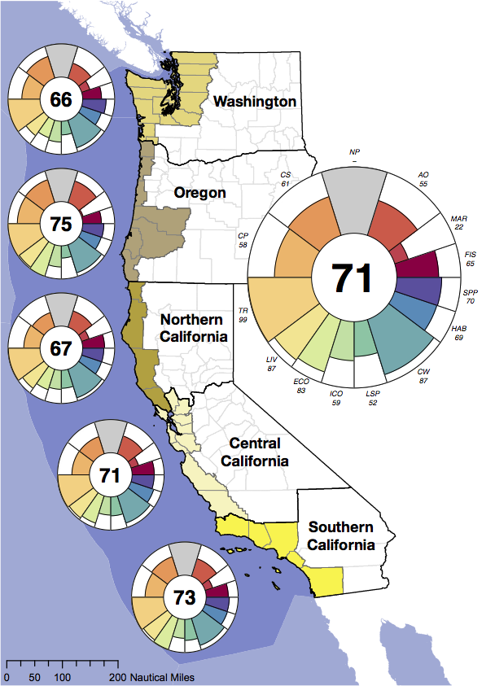
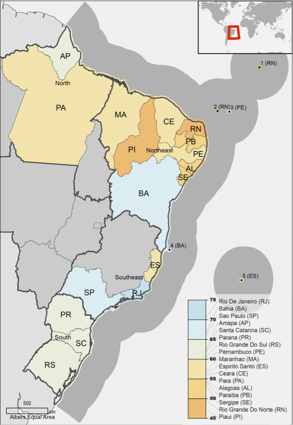
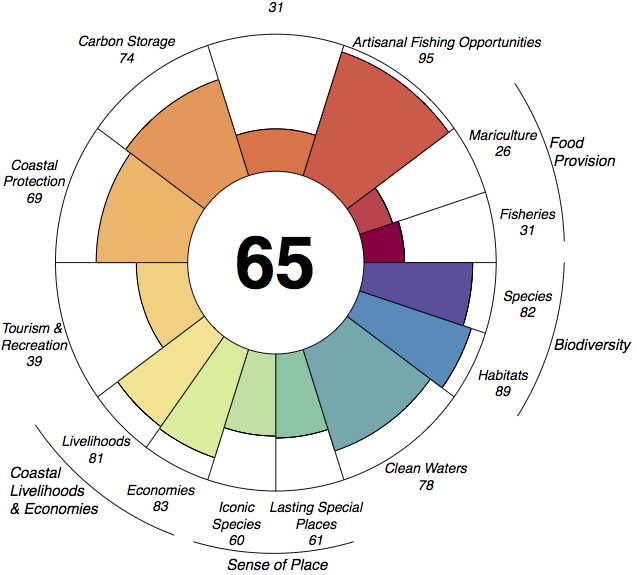
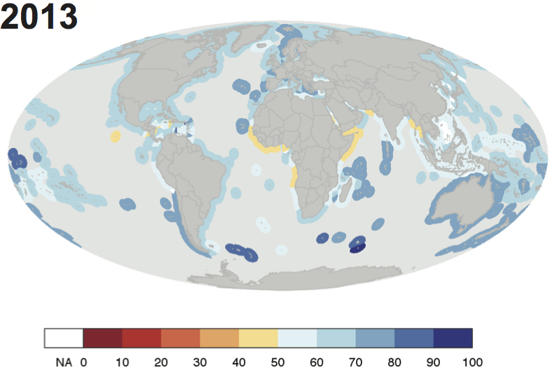
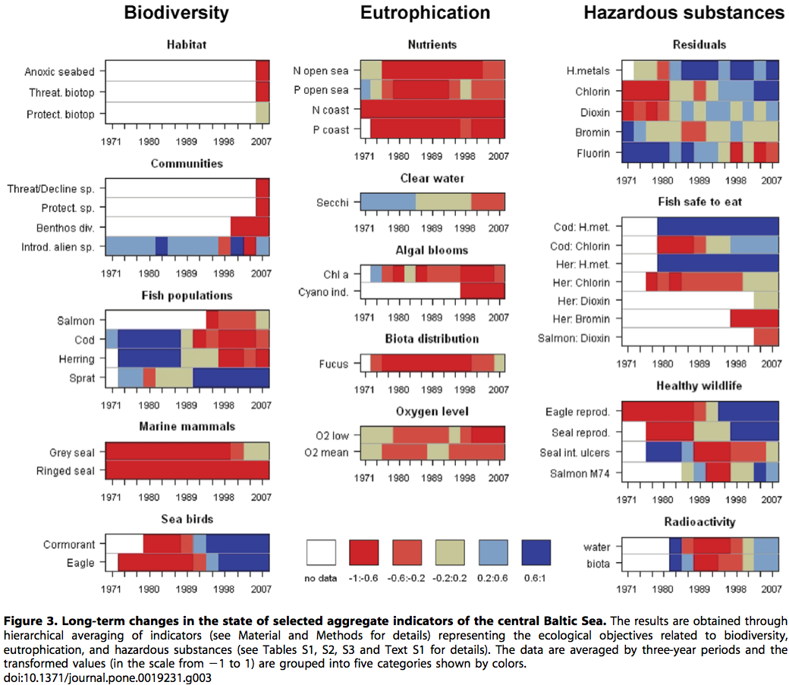

OHI Toolbox for the Baltic
========================================================
author: Ben Best (bbest@nceas.ucsb.eduas)
date: 2014-05-14
transition: concave
transition-speed: fast
incremental: true

http://bbest.github.io/talks/2014-05_BHI-tbx

Outline
====
type: section
- Goals
- Demo
- Details
- Next

Goals
====
- **Recalculate** OHI globally or regionally using alternative weights, equations, layers, etc.
- **Regionalize** based on administrative boundaries finer than EEZ.
- **Visualize** results to highlight best opportunities for improving ocean health.
- **Interface** with easy-to-use forms for sliding weights and concocting scenarios.
- **Automate** with tools for manipulating input layers and calculating OHI scores for sensitivity analyses.

Regionalize
====

**US West Coast**
Halpern et al (_in press_) _PLoS ONE_


***

**Brazil**
Elfes et al (2014) _PLoS ONE_


Visualize
====
**Flower**


***

**Map**


Software choices for reproducible science
====
free, cross-platform, open source, web based
- [**R**](http://www.r-project.org/) having libraries `shiny` web application, `ggplot2` figures, `dplyr` data manipulation
    + [RStudio](http://www.rstudio.com) excellent front end
- **csv** (comma-seperated value) data files. ancillary: md, json, shp, geotiff
    + Excel poor with Unicode, file locking. Try [OpenOffice](https://www.openoffice.org/) instead. 
- [**Github**](http://github.com) repositories: `ohicore`, `ohigui`, `ohibaltic`
    + **backup** to offsite archive, and **rewind** changes
    + **document** changes of code and files with issues and messages
    + **collaborate** with others and **publish** to web site
    
Demo
====
type: section
- [OHI-Science.org](http://OHI-Science.org)
    + articles, data, code, manual... 
- install
    + Global
    + Baltic 
    [http://github.com/bbest/ohibaltic](http://github.com/bbest/ohibaltic)
   
Outline
====
type: section
- Goals
- Demo
- **Details**
- Next

Scenario files
====
incremental: false
- layers.csv, layers/
    + *.csv
- scenario.R, conf/
    + config.R
    + pressures_matrix.csv, resilience_matrix.csv, resilience_weights.csv
    + goals.csv
    + functions.R
- spatial/regions_gcs.js
- launchApp_code.R, launchApp.bat (Win), launchApp.command (Mac)
- scores.csv
- results/report.html, /figures

Simulation
====
For example, calculate Baltic Health Index every year using scenarios `bhi_1980,..., bhi_2014` as folders. (Jasper's suggestion)


```r
library(ohicore)
dir_scenarios = '~/ohibaltic/scenarios'
  
for (yr in 1980:2014){
  scenario = paste0('bhi_', yr)
  setwd(file.path(dir_scenarios, scenario))
  
  conf   = Conf('conf')
  layers = Layers('layers.csv', 'layers')
  scores = CalculateAll(conf, layers)
  
  write.csv(scores, 'scores.csv')
}
```


Outline
====
type: section
- Goals
- Demo
- Details
- **Next**

Next for toolbox
====
1. Fold `ohigui` into `ohicore`.
1. "Clip and ship" subnational OHI assessments for all countries globally.
1. Make gui interactive online, a la [shiny gallery](http://shiny.rstudio.com/gallery/).
1. Add comparison report of scenarios feature.
1. Add "Description" tab under "Data" for equations / details per input layer / output score.
1. Document layers using [Tabular Data Package](http://dataprotocols.org/tabular-data-package/) format.
1. Integrate histogram and map using [rMaps](https://github.com/ramnathv/rMaps#quick-start).
1. Capture uncertainty...

Next for BHI: pressures
====
Extract average regional pressures from [HELCOM Holistic Assessment of Ecosystem Health Status (HOLAS) and Baltic Sea Pressure/ Impact Indices (BSPI/BSII)](http://www.helcom.fi/Lists/Publications/BSEP122.pdf), supplement with Halpern et al [Cumulative Impacts](http://www.nceas.ucsb.edu/globalmarine).


Next for BHI: time series, esp CW (N, O)
====
Ojaveer, H., and Eero, M. (2011). [Methodological Challenges in Assessing the Environmental Status of a                     Marine Ecosystem: Case Study of the Baltic Sea](http://www.plosone.org/article/info%3Adoi%2F10.1371%2Fjournal.pone.0019231). _PLoS ONE_.


***

Carstensen, J., Andersen, J.H., Gustafsson, B.G., and Conley, D.J. (2014). [Deoxygenation of the Baltic Sea during the last century](http://www.pnas.org/content/early/2014/03/27/1323156111.abstract). _PNAS_.


Next for BHI...
====
1. Fix regions. 
1. Extract coastal population, area, etc for aggregating up to country or basin and disaggregating from global
get rgn weightings by popn, area, coastal strip, revenue etc and disaggregate global layers more appropriately
1. Consider resilience measures
1. ...
