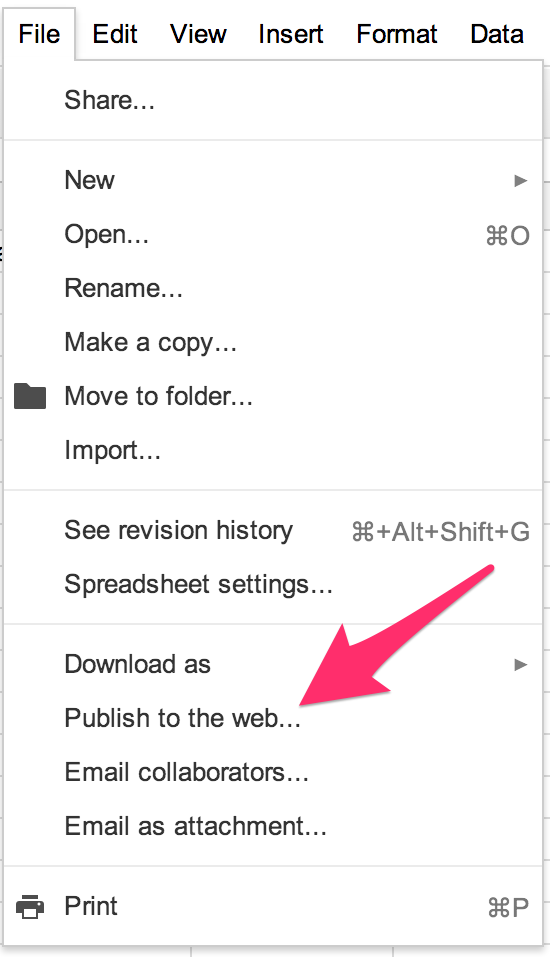

Consuming Google Tables from R
========================================================
author: Ben Best (bbest@nceas.ucsb.edu)
date: 2014-05-21
transition: concave
transition-speed: fast
incremental: true

http://bbest.github.io/talks/2014-05_R-GoogleData

Outline
====
type: section
- Google options
- Sheet
- Fusion Table
- Big Query

Google options
====
- **Sheet**: easy to share and create, most similar to Excel. limits: 400,000 cells, 256 columns per sheet, 200 sheets, 20 MB
- **Fusion Table**: bigger tables, spatial option. limits: 100 MB per file, 250 MB per user ([details](http://stackoverflow.com/questions/11952166/what-are-the-technical-limitations-when-using-fusion-tables))
- **Big Query**: pricing model...

Why Google Spreadsheet?
====
- online, **collaborative** (simultaneous editing OK)
- free, feature rich like Excel
- easy

  

Setup Google Sheet URL
====
Almost easy. The brand [new Google Sheets](https://support.google.com/docs/answer/3541068?hl=en) has [dropped the csv export feature](https://support.google.com/docs/answer/3543688?hl=en&ref_topic=20322). But there's still a way...

1. Share the Google Doc so anyone with the link can view
1. Publish the document (File > Publish to the Web) and look for the document ID in the URL
1. Add that document ID into this URL in place of KEY:
```
https://docs.google.com/spreadsheets/d/<KEY>/export?format=csv&id=<KEY>
```
1. While editing your Google Doc, open the worksheet you want to export and look in the URL for the GID parameter
```
https://docs.google.com/spreadsheets/d/<KEY>/export?format=csv&id=<KEY>&gid=<GID>
```

source: [Adam Lofting](http://adamlofting.com/1098/new-google-sheets-publishing-a-single-worksheet-to-the-web-as-csv/)

Read Sheet into R
====
Consume [test sheet](https://docs.google.com/a/nceas.ucsb.edu/spreadsheets/d/1Jjtv9dhJvhaxhvEdnnzmBzM6d9avc_KmIYVF_Xi-Or4/edit#gid=0).


```r
library(RCurl)
KEY='1Jjtv9dhJvhaxhvEdnnzmBzM6d9avc_KmIYVF_Xi-Or4'
GID=0
s = 'https://docs.google.com/spreadsheets/d/%s/export?format=csv&id=%s&gid=%d'
u = sprintf(s, KEY, KEY, GID)  
g = getURL(u, ssl.verifypeer = FALSE)
x = textConnection(g)
g = read.csv(x, na.strings='')
print(g)
```

```
  a   b
1 1 1.3
2 2 1.2
3 3 1.1
```


Why Fusion Tables?
====
- read and write
- mapping and geocoding
- use R package GFusionTables

Install GFusionTables
====

```r
# download and unzip
download.file('http://gfusiontables.lopatenko.com/GFusionTables_1.4.tar.gz', 'GFusionTables_1.4.tar.gz')
untar('GFusionTables_1.4.tar.gz', compressed='gzip', tar='/usr/bin/tar')

# create NAMESPACE and install
writeLines('exportPattern("^[^\\\\.]")', 'GFusionTables/NAMESPACE')
system(paste0("R CMD INSTALL ", getwd(), '/GFusionTables'))

# check
library(GFusionTables)

# cleanup
unlink(c('GFusionTables_1.4.tar.gz','GFusionTables'))
```


Using GFusionTables
====
But got error


```r
library(GFusionTables)

passwd = scan('~/.gpass', what='character', quiet=T)
auth <- ft.connect('bbest@nceas.ucsb.edu', passwd)
# Error: Forbidden
traceback()
#4: stop(err)
#3: stop.if.HTTP.error(http.header)
#2: postForm(uri = url, .params = params)
#1: ft.connect("bbest@nceas.ucsb.edu", passwd)
# Probably OAuth related, otherwise would like this...

# read table
d = read.csv('talks/2014-05_R-GoogleData/data/UseR_conf.csv')

# write new table
ft.exportdata(auth, input_frame=d, table_name="test", create_table=TRUE)

# List all my tables:
ft.showtables(auth)
ft.describetable(auth, "Soil data sources (URLs)")

ft.importdata(auth, "Soil data sources (URLs)")
```


Big Query
====

False starts...

```r
library(bigrquery) # devtools::install_github('hadley/bigrquery')
library(dplyr)

# trying dplyr sample batting db
batting <- tbl(lahman_bigquery(), "Batting")
# Use a local file to cache OAuth access credentials between R sessions?
# 1: Yes
# 2: No
# 
# Selection: 1
# Adding .httr-oauth to .gitignore
# Waiting for authentication in browser...
# Press Esc/Ctrl + C to abort
# Authentication complete.
# Error: HTTP error [404] Not Found

# trying Google sample datasets
bq_db = src_bigquery('publicdata', 'samples')
bq_db
# src:  bigquery [publicdata/samples]
# tbls: github_nested, github_timeline, gsod, natality, shakespeare, trigrams, wikipedia
d = tbl(bq_db, 'github_nested')
# Error in UseMethod("sql_select") : 
#  no applicable method for 'sql_select' applied to an object of class "bigquery"

# looking at bigrquery suggests billing required
billing_project <- "341409650721" # put your project number here
sql <- "SELECT year, month, day, weight_pounds FROM natality LIMIT 5"
query_exec("publicdata", "samples", sql, billing = billing_project)
# Error: Access Denied: Job 341409650721:job_pkE0hOVl4E61QKHIBlrOvGL-AY0: RUN_QUERY_JOB
```

[bigrquery sample](https://github.com/hadley/bigrquery#sample-data-and-a-billing-project)...
